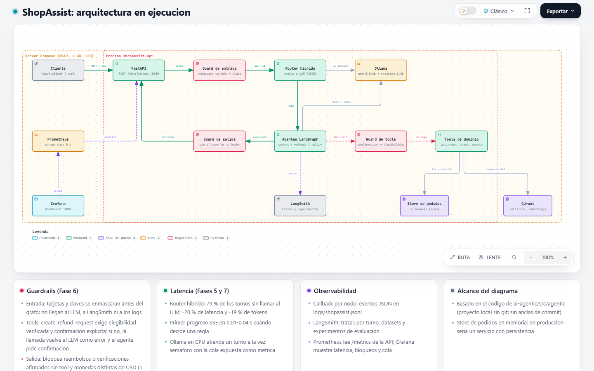

# ShopAssist agentic

Asistente de soporte de reembolsos para una tienda online, construido con un LLM local y organizado en ocho fases:
agente con tools, multi-agent, RAG, evaluación, observabilidad, guardrails y streaming.

Las reglas de negocio (plazo de 30 días, productos digitales, montos sobre 200 USD) son deterministas, por lo que
cada respuesta del agente se puede verificar contra un resultado esperado.



## Stack

| Capa | Tecnología |
|---|---|
| LLM local | Ollama: `qwen3.5:4b` (principal), `granite4.1:3b` (fallback), `qwen3-embedding:0.6b` (embeddings) |
| Orquestación | LangChain, LangGraph |
| Recuperación | Qdrant |
| Evaluación y trazas | LangSmith |
| API | FastAPI con SSE |
| Métricas | Prometheus, Grafana |
| Infraestructura | Docker Compose sobre WSL2 |
| Tests | pytest (sin LLM) |

## Fases

| Fase | Tema | Contenido | Resultado principal |
|---|---|---|---|
| 0 | [Setup](docs/fase-00-setup.md) | Docker, Ollama, LangSmith, healthcheck | Entorno reproducible en CPU |
| 1 | [Agente con tools](docs/fase-01-agente-tools.md) | Loop agéntico manual, tool calling, errores como datos | 11/15 casos |
| 2 | [Multi-agent](docs/fase-02-multiagent.md) | Router, especialistas, handoffs, memoria por conversación | 11/12 casos |
| 3 | [RAG](docs/fase-03-rag.md) | Políticas en Qdrant, citas, evaluación de retrieval | hit@3 = 1.00, MRR = 0.93 |
| 4 | [Evaluación](docs/fase-04-evaluacion.md) | Datasets en LangSmith, LLM-as-judge calibrado, gate de regresión | Juez de reglas con 0 FP |
| 5 | [Observabilidad](docs/fase-05-observabilidad.md) | Logs JSON, métricas por nodo, router híbrido | -20 % latencia, -19 % tokens |
| 6 | [Guardrails](docs/fase-06-guardrails.md) | Entrada, políticas por tool, salida, resiliencia | Reembolsos sin confirmación: 0/9 → 9/9 |
| 7 | [Streaming](docs/fase-07-streaming.md) | API con SSE, TTFT, backpressure, Prometheus y Grafana | Primer progreso en 0.01-0.04 s |

Documentación complementaria:

| Documento | Contenido |
|---|---|
| [docs/RESULTADOS.md](docs/RESULTADOS.md) | Métricas por fase, decisiones de diseño y limitaciones |
| [docs/diagramas/](docs/diagramas/README.md) | Arquitectura, secuencias del flujo de reembolso, ciclo de vida y ciclo de evaluación |

## Requisitos

| Recurso | Mínimo |
|---|---|
| Docker Desktop | Backend WSL2 (o Python 3.11+ para ejecución local) |
| RAM para WSL2 | 8 GB (modelos de Ollama en CPU; GPU NVIDIA opcional, ver [Fase 0](docs/fase-00-setup.md)) |
| Disco | ~7 GB para modelos e imágenes |
| LangSmith | Cuenta gratuita y API key |

## Inicio rápido

```powershell
Copy-Item .env.example .env                 # completar LANGSMITH_API_KEY
docker compose up -d ollama qdrant
docker compose run --rm ollama-pull         # ~6 GB la primera vez
docker compose build app api
docker compose run --rm app python scripts/fase3_ingest.py
docker compose run --rm app python scripts/fase0_healthcheck.py
docker compose run --rm app pytest -q

# chat por consola con el sistema completo
docker compose run --rm app python scripts/fase2_chat.py

# API con streaming y monitoreo
docker compose up -d api
docker compose --profile monitoring up -d
docker compose run --rm app python scripts/fase7_client.py chat
```

| Servicio | URL |
|---|---|
| API (Swagger) | http://localhost:8000/docs |
| Prometheus | http://localhost:9090 |
| Grafana | http://localhost:3000/d/shopassist/shopassist-api-y-agentes |
| Qdrant | http://localhost:6333/dashboard |

## Estructura

```
ai-agentic/
├── docker-compose.yml     # ollama, qdrant, app, api; ollama-pull (perfil tools); prometheus y grafana (perfil monitoring)
├── Dockerfile             # imagen Python 3.11 de app y api
├── .env.example           # configuración (copiar a .env)
├── infra/                 # Prometheus y dashboard de Grafana
├── knowledge/             # políticas de la tienda (base del RAG)
├── src/agentic/
│   ├── config.py          # configuración desde .env
│   ├── llm.py             # ChatOllama, modelo resiliente, digests de modelos
│   ├── agent.py           # Fase 1: loop agéntico
│   ├── multiagent.py      # Fases 2-7: grafo LangGraph, router híbrido, ejecución por turno
│   ├── rag.py             # Fase 3: chunking, embeddings, Qdrant, search_policies
│   ├── tools.py           # tools del dominio
│   ├── evalkit.py         # checks, métricas y reportes de evaluación
│   ├── graph_eval.py      # runner de casos multi-turno
│   ├── experiments.py     # Fase 4: datasets, evaluadores, regresiones
│   ├── judges.py          # Fase 4: LLM-as-judge
│   ├── facts.py           # Fase 4: hechos verificables por código
│   ├── observability.py   # Fase 5: logs JSON y callback por nodo
│   ├── guardrails.py      # Fase 6: entrada, tools, salida, resiliencia
│   ├── api.py             # Fase 7: FastAPI, SSE, backpressure
│   ├── metrics.py         # Fase 7: métricas Prometheus
│   └── domain/            # pedidos y política de reembolso
├── evals/                 # casos de evaluación (JSON)
├── scripts/               # entrypoints por fase
├── tests/                 # 156 tests sin LLM
├── reports/               # reportes de evaluación (no versionado)
├── logs/                  # logs JSON (no versionado)
└── docs/                  # guías por fase, resultados y diagramas
```

## Ejecución local sin Docker para el código

Ollama y Qdrant siguen en Docker; scripts y tests corren con un entorno Python local (ver
[Fase 0](docs/fase-00-setup.md#opción-b-entorno-python-local)).
