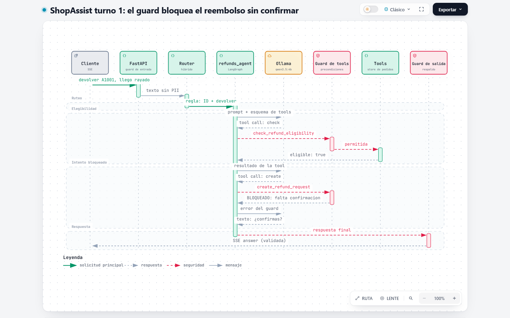
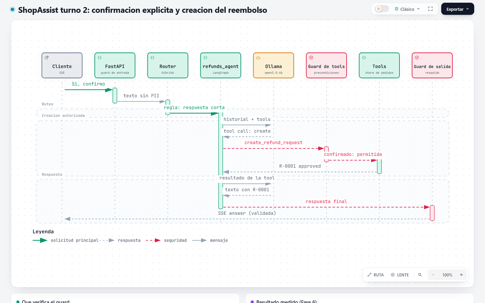
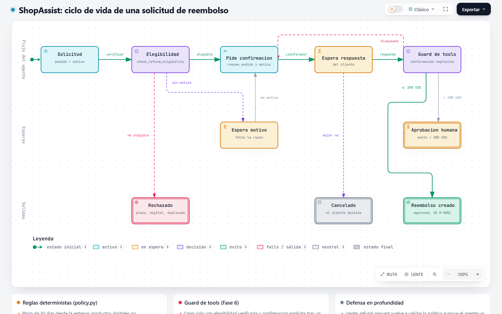
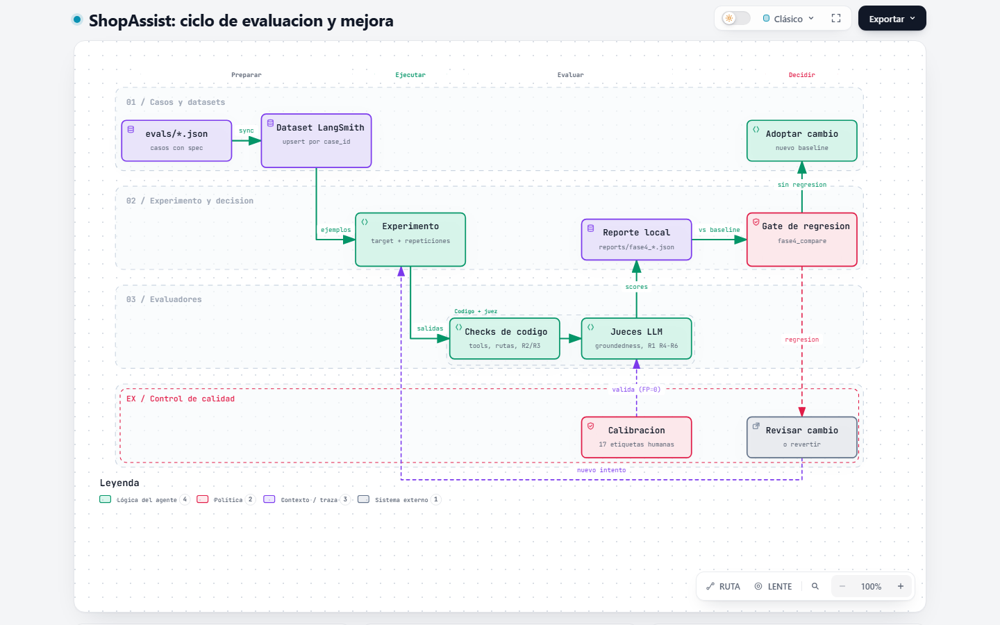

# Diagramas de ShopAssist

Diagramas interactivos generados con [Archify](https://github.com/tt-a1i/archify) a partir del código del proyecto.
Cada carpeta contiene el HTML (zoom, tema oscuro, exportación a PNG/SVG), el `candidate.json` fuente y los recibos de
validación. Las imágenes son capturas de escritorio (1440 x 900, tema claro).

| # | Diagrama | Contenido | HTML |
|---|---|---|---|
| 1 | Arquitectura en ejecución | Componentes, procesos y conexiones | [arquitectura-runtime.html](arquitectura-runtime/arquitectura-runtime.html) |
| 2 | Turno 1: bloqueo del reembolso | Pedido con motivo, intento de creación bloqueado y pedido de confirmación | [secuencia-turno1-bloqueo.html](secuencia-turno1-bloqueo/secuencia-turno1-bloqueo.html) |
| 3 | Turno 2: confirmación | Confirmación explícita y creación del reembolso | [secuencia-turno2-confirmacion.html](secuencia-turno2-confirmacion/secuencia-turno2-confirmacion.html) |
| 4 | Ciclo de vida del reembolso | Estados de una solicitud y salidas | [ciclo-vida-reembolso.html](ciclo-vida-reembolso/ciclo-vida-reembolso.html) |
| 5 | Ciclo de evaluación y mejora | Desde los casos de prueba hasta la decisión de adoptar un cambio | [workflow-evaluacion.html](workflow-evaluacion/workflow-evaluacion.html) |

## 1. Arquitectura en ejecución

Recorrido principal: cliente → FastAPI → guard de entrada → router híbrido → agentes → guard de tools → tools. La
respuesta vuelve por el guard de salida. Ollama atiende al router (solo cuando las reglas no deciden) y a los agentes.


## 2 y 3. Reembolso con confirmación

Con el motivo en el primer mensaje, el agente intenta crear el reembolso; el guard de tools bloquea la llamada, el
agente pide confirmación y el reembolso se crea en el turno siguiente (caso medido en la [Fase 6](../fase-06-guardrails.md)).





## 4. Ciclo de vida de una solicitud de reembolso

Estados según `policy.py` y los guardrails: rechazo por política, esperas del cliente, retorno por bloqueo y
aprobación humana sobre 200 USD.



## 5. Ciclo de evaluación y mejora

Casos → dataset versionado → experimento → evaluadores (código y juez calibrado) → reporte → gate de regresión
([Fase 4](../fase-04-evaluacion.md)).



## Regenerar

```powershell
# Archify (una vez)
git clone --depth 1 https://github.com/tt-a1i/archify.git C:\herramientas\archify-src
$env:ARCHIFY_DIR = "C:\herramientas\archify-src\archify"
$env:ARCHIFY_CHROME = "${env:ProgramFiles(x86)}\Microsoft\Edge\Application\msedge.exe"   # o Chrome

# Candidatos JSON (desde ai-agentic/)
python docs/diagramas/generar_diagramas.py .

# Validación y HTML por diagrama (tipos: architecture, sequence, lifecycle, workflow)
node $env:ARCHIFY_DIR\bin\archify.mjs finalize architecture docs/diagramas/arquitectura-runtime/candidate.json docs/diagramas/arquitectura-runtime/arquitectura-runtime.html --quality showcase --json
```

Antes de regenerar un HTML existente, borrar los archivos generados de su carpeta excepto `candidate.json`: Archify
no reemplaza la evidencia de validación de una entrega anterior.

## Validación

| Control | Resultado |
|---|---|
| `finalize` (esquema, generación, chequeo estricto, navegador con Edge), perfil `showcase` | 5/5 aprobados |
| Revisión visual de capturas | Corregidos: Qdrant fuera del grupo del proceso, etiqueta de segmento tapada en las secuencias y etiqueta sobre el borde de una franja en el workflow |
| Reproducibilidad | `generar_diagramas.py` reproduce los 5 `candidate.json` byte a byte |

| Limitación | Detalle |
|---|---|
| Sin anclas de commit | El proyecto no es un repositorio git; los diagramas reflejan el código al 02/10/2026 |
| Interfaz del visor | Textos de interfaz del catálogo en español de Archify |
