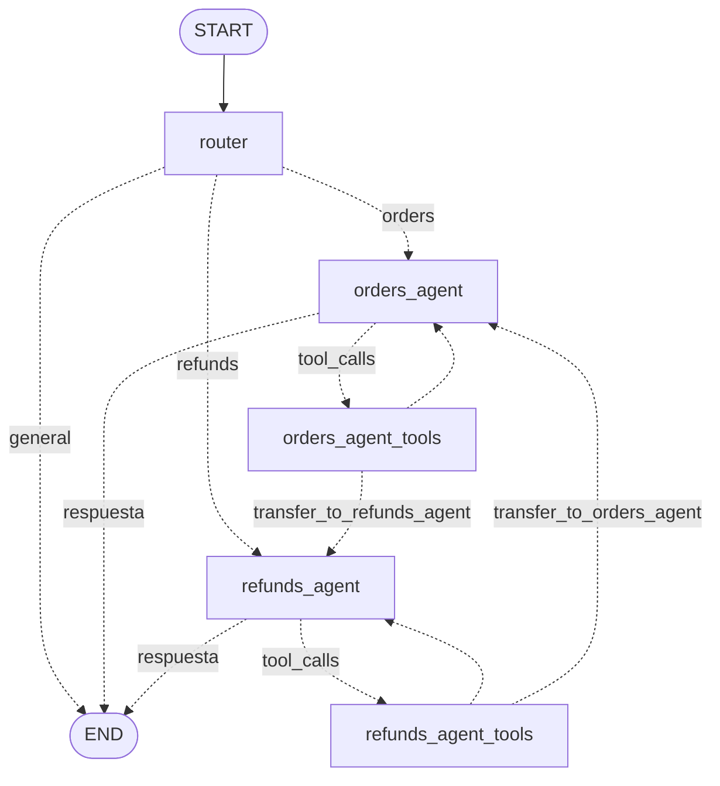

# Fase 2 — Multi-agent con LangGraph

## Objetivo

Pasar del loop manual (Fase 1) a un grafo con router, agentes especialistas, handoffs y memoria por conversacion.

## Arquitectura

Codigo: [multiagent.py](../src/agentic/multiagent.py)



| Nodo | Responsabilidad | Tools |
|---|---|---|
| `router` | Clasifica cada turno (`orders`, `refunds`, `general`) con salida estructurada. Responde saludos y temas ajenos. | — |
| `orders_agent` | Consultas de estado, producto, monto y fechas. | `get_order`, `transfer_to_refunds_agent` |
| `refunds_agent` | Flujo de reembolso con confirmacion. | `get_order`, `check_refund_eligibility`, `create_refund_request`, `transfer_to_orders_agent` |
| `*_tools` | `ToolNode` de LangGraph: ejecuta las tools y convierte excepciones en mensajes de error. | — |

## Conceptos

**Estado compartido (`ShopState`).** Extiende `MessagesState` con `route`, `route_reason` y `active_agent`.
Cada nodo devuelve solo los campos que modifica; LangGraph los fusiona (el reducer de `messages` concatena).

**Router con salida estructurada.** `llm.with_structured_output(RouteDecision)` usa JSON schema nativo de Ollama:
la respuesta se valida con Pydantic, sin parsear texto libre. El router recibe un resumen de los ultimos
mensajes y el agente activo, lo que permite enrutar respuestas cortas ("Si, confirmo") al agente correcto.

**Handoff.** Un especialista llama `transfer_to_<agente>(reason)`. La tool no ejecuta logica de negocio:
devuelve `{"transfer_to": ...}` y el edge condicional `after_tools` envia el control al destino.
El agente destino recibe todo el historial, incluida la razon del handoff.

**Limite de handoffs.** `MAX_HANDOFFS_PER_TURN = 2`. La tool lee el estado (`InjectedState`) y rechaza
transferencias adicionales en el mismo turno, evitando ping-pong entre agentes. `recursion_limit = 20`
corta cualquier otro ciclo (`GraphRecursionError` → mensaje de limite).

**Memoria (checkpointer).** `InMemorySaver` guarda el estado del grafo por `thread_id` despues de cada paso.
Cada `send(thread_id, texto)` agrega solo el mensaje nuevo; el historial ya esta en el checkpoint.
En produccion se reemplaza por `SqliteSaver` / `PostgresSaver` (persistencia entre procesos) sin cambiar el grafo.

| Tipo de memoria | Implementacion aqui | Alcance |
|---|---|---|
| Corto plazo (conversacion) | Checkpointer por `thread_id` | Un hilo |
| Largo plazo (cliente) | No implementada (LangGraph `Store`) | Entre hilos |

**Politica de confirmacion.** `refunds_agent` pide motivo y confirmacion explicita antes de `create_refund_request`
(accion irreversible). Resuelve la ambiguedad detectada en la evaluacion de Fase 1, donde 4 de 15 casos fallaron
porque el prompt no definia si confirmar.

## Ejecucion

```powershell
# chat con flujo en vivo (router, agentes, tools, handoffs)
docker compose run --rm app python scripts/fase2_chat.py

# evaluacion (12 casos, incluye multi-turno y adversariales)
docker compose run --rm app python scripts/fase2_eval.py
docker compose run --rm app python scripts/fase2_eval.py 04 09 --reasoning

# tests (sin Ollama): routing, handoff, limite, memoria, aislamiento de hilos
docker compose run --rm app pytest -q
```

Comandos del chat: `/nuevo` (nuevo `thread_id`), `/estado` (agente activo y cantidad de mensajes).

Salida del chat por turno:
```
  [ROUTER] -> refunds_agent | refunds: el cliente quiere devolver un pedido
  [LLM refunds_agent] 9.8s | tokens 820 -> 31
      decide: check_refund_eligibility({"order_id": "A1001"})
    [TOOL] check_refund_eligibility -> {"order_id": "A1001", "eligible": true, ...}
  [LLM refunds_agent] 7.1s | tokens 905 -> 45
      decide: respuesta final
ShopAssist: El pedido A1001 es elegible...
```

## LangSmith

Cada turno aparece como run `shopassist_graph` con un hijo por nodo (`router`, `refunds_agent`, `refunds_agent_tools`...).
Filtrar por tag `fase2-eval` o `fase2-chat`; `metadata.thread_id` agrupa los turnos de una conversacion
(pestana **Threads** del proyecto).

**Robustez del router.** `with_structured_output(..., include_raw=True)` devuelve `raw` (AIMessage con latencia
y tokens) y `parsed`. Si el JSON es invalido (`parsed=None`), `fallback_decision` continua con el agente activo
o responde de forma generica, en lugar de romper el turno.

## Costo de la arquitectura

Cada turno agrega una llamada al LLM (router) respecto de Fase 1. El resumen de `fase2_eval.py` incluye
latencia media, p95 y total por nodo (`latency_by_node` en el reporte JSON).

Primera corrida (qwen3.5:4b, CPU): el router no registraba metricas (`with_structured_output` sin `include_raw`
descarta el AIMessage). Estimado por diferencia: ~20 s por turno, el nodo mas caro. Causa probable: `reason`
largo (>150 caracteres generados en CPU). Mitigaciones aplicadas: metricas con `include_raw` y `reason` de
maximo 10 palabras. Siguientes opciones si sigue dominando: reglas deterministas previas (regex de ID +
palabras clave) o un modelo mas chico solo para routing.

## Resultado de referencia

11/12 casos PASS. Falla `05-pide-motivo`: tras recibir el motivo, el agente creo el reembolso sin pedir
confirmacion (paso 4 del prompt omitido). Una regla en el prompt no es una garantia; se resuelve en Fase 6
con un control deterministico (interrupt / gate de confirmacion). El caso queda como regression test.

## Ejercicios

1. Correr `fase2_eval.py` y comparar el caso `04` con el caso `01` de Fase 1 (misma solicitud, politica distinta).
2. Forzar un handoff: "Que compre en el A1005? Si es el monitor quiero devolverlo". ¿Quien atiende y cuantos handoffs hay?
3. Bajar `MAX_HANDOFFS_PER_TURN` a 0 y observar como responde el agente al recibir el error de la tool.
4. Reemplazar `InMemorySaver` por `SqliteSaver` (`langgraph-checkpoint-sqlite`) y retomar una conversacion tras reiniciar el script.
5. Agregar un tercer especialista (p. ej. `shipping_agent` con una tool de tracking) y su handoff.

## Checklist

- [ ] Dibujar el grafo y explicar cada edge condicional.
- [ ] Diferenciar router (decide al inicio del turno) de handoff (decide un especialista durante el turno).
- [ ] Explicar como se evita el ping-pong entre agentes y los loops infinitos.
- [ ] Explicar que guarda el checkpointer, por que `thread_id`, y como pasar a persistencia real.
- [ ] Justificar el trade-off latencia vs especializacion de tener un router extra.
