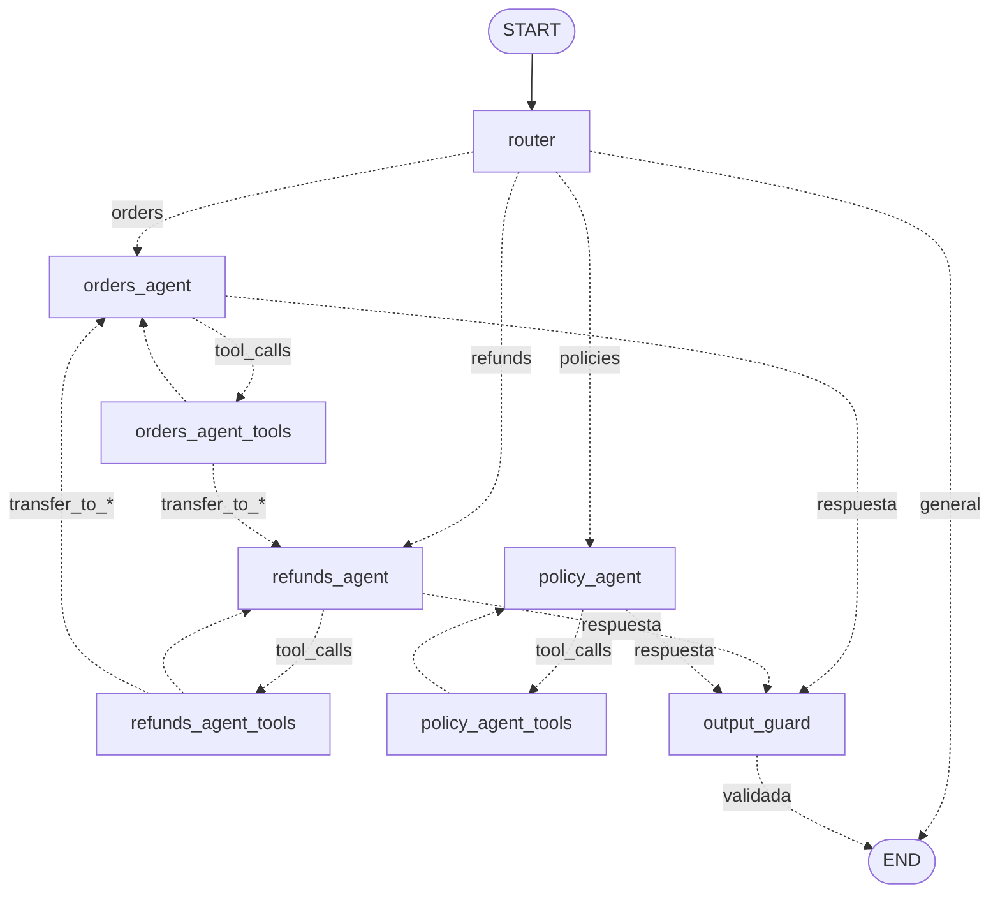

# Fase 2: multi-agent con LangGraph

Grafo con router, agentes especialistas, handoffs entre agentes y memoria por conversación. Reemplaza el loop manual
de la Fase 1.

Código: [multiagent.py](../src/agentic/multiagent.py)

## Grafo



`policy_agent` se agrega en la Fase 3 y `output_guard` en la Fase 6. Cualquier nodo `*_tools` puede transferir a
cualquier agente; el diagrama muestra dos transferencias como ejemplo.

| Nodo | Responsabilidad | Tools |
|---|---|---|
| `router` | Clasifica cada turno (`orders`, `refunds`, `policies`, `general`) con salida estructurada; responde saludos y temas ajenos | - |
| `orders_agent` | Estado, producto, monto y fechas de un pedido | `get_order`, `transfer_to_refunds_agent`, `transfer_to_policy_agent` |
| `refunds_agent` | Flujo de reembolso con confirmación | `get_order`, `check_refund_eligibility`, `create_refund_request`, `transfer_to_orders_agent`, `transfer_to_policy_agent` |
| `policy_agent` | Preguntas generales sobre políticas (RAG, Fase 3) | `search_policies`, `transfer_to_refunds_agent`, `transfer_to_orders_agent` |
| `*_tools` | `ToolNode` de LangGraph envuelto por el guard de tools (Fase 6) | - |

## Diseño

| Elemento | Implementación |
|---|---|
| Estado (`ShopState`) | `MessagesState` + `route`, `route_reason`, `active_agent`, `router_step`; cada nodo devuelve solo los campos que modifica |
| Router | `with_structured_output(RouteDecision, include_raw=True)`: JSON schema validado con Pydantic; conserva latencia y tokens del LLM |
| Contexto del router | Últimos 6 mensajes y agente activo: permite enrutar respuestas cortas ("Sí, confirmo") al agente correcto |
| Router con JSON inválido | `fallback_decision`: sigue con el agente activo o responde de forma genérica |
| Handoff | `transfer_to_<agente>(reason)` devuelve `{"transfer_to": ...}`; el edge `after_tools` envía el control al destino con todo el historial |
| Límite de handoffs | `MAX_HANDOFFS_PER_TURN = 2` (la tool lee el estado con `InjectedState`); `recursion_limit = 20` para cualquier otro ciclo |
| Memoria | `InMemorySaver` por `thread_id`; cada turno agrega solo el mensaje nuevo |
| Política de confirmación | `refunds_agent` pide motivo y confirmación explícita antes de `create_refund_request` |

| Memoria | Implementación | Alcance |
|---|---|---|
| Corto plazo (conversación) | Checkpointer por `thread_id` | Un hilo |
| Largo plazo (cliente) | No implementada (`Store` de LangGraph) | Entre hilos |

## Ejecución

```powershell
docker compose run --rm app python scripts/fase2_chat.py              # comandos: /nuevo, /estado, salir
docker compose run --rm app python scripts/fase2_eval.py              # 12 casos multi-turno y adversariales
docker compose run --rm app python scripts/fase2_eval.py 04 09 --reasoning
docker compose run --rm app pytest -q tests/test_multiagent.py
```

Salida del chat por turno:

```
  [ROUTER:rules] 0.0s | tokens 0 -> 0 | -> refunds_agent | refunds: regla: ID de pedido + intencion de devolucion
  [LLM refunds_agent] 9.8s | tokens 820 -> 31
      decide: check_refund_eligibility({"order_id": "A1001"})
    [TOOL] check_refund_eligibility -> {"order_id": "A1001", "eligible": true, ...}
  [LLM refunds_agent] 7.1s | tokens 905 -> 45
      decide: respuesta final
ShopAssist: El pedido A1001 es elegible...
```

En LangSmith cada turno es un run `shopassist_graph` con un hijo por nodo; `metadata.thread_id` agrupa los turnos de
una conversación (pestaña Threads).

## Resultados

`qwen3.5:4b`, CPU: **11/12 casos**.

| Hallazgo | Acción |
|---|---|
| `05-pide-motivo`: tras recibir el motivo, el agente crea el reembolso sin pedir confirmación | Guard de tools en código (Fase 6); el caso queda como test de regresión |
| El router no registraba latencia (`with_structured_output` descarta el mensaje original); estimado ~20 s por turno | `include_raw=True` y `reason` de máximo 10 palabras |
| Agregar `transfer_to_policy_agent` al agente de reembolsos cambió su comportamiento en un caso no relacionado | El esquema de las tools es parte del prompt: todo cambio pasa por la regresión completa (Fase 4) |

## Extensiones

| Extensión | Descripción |
|---|---|
| Persistencia | `SqliteSaver` o `PostgresSaver` en lugar de `InMemorySaver`, sin cambiar el grafo |
| Nuevo especialista | `shipping_agent` con tool de tracking y su handoff |
| Memoria de largo plazo | Preferencias del cliente con `Store` de LangGraph |
